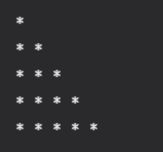

# Unit 2 Section 6 Exercise 2
This example project is written in Python, and tested with pytest.

### The assignment
Create a function that takes in a number, then prints a triangle of * with that number of rows:

### Input
5

### Output

