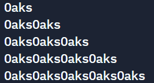

# Unit 2 Section 6 Exercise 2
This example project is written in Python, and tested with pytest.

### The assignment
Create a function that takes in a number and a word, then prints a triangle of the word with that number of rows:

### Inputs
5, Oaks

### Output

